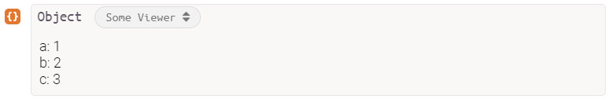

# Kve [](https://travis-ci.com/Richienb/kve)

Kve (pronounced Kay-vee) lets you create better [Runkit](https://runkit.com/) [custom value viewers](https://runkit.com/docs/value-viewers).

[](https://npmjs.com/package/kve)

## Improvements

- Custom viewer is made non-enumerable.
- The lowercase `html` key can be set instead of `HTML`.
- Fetching and setting the symbol is done automatically.
- Allows for mutating the object or returning a new one.
- The html and title can be set to a function which returns a computed value.

## Install

```sh
npm install kve
```

## Usage

```js
const kve = require("kve");

kve(
	{ a: 1, b: 2, c: 3 },
	{
		title: "Some Viewer",
		html: obj =>
			Object.entries(obj)
				.map(([name, value]) => `${name}: ${value}`)
				.join("<br>")
	}
);
```

### Output



## API

### kve(object, options)

#### object

Type: `object`

The object to modify.

#### options

Type: `object`

##### html

Type: `string | function`

The HTML of the value viewer.

##### title

Type: `string | function`

The title of the value viewer.

##### mutate

Type: `boolean`\
Default: `false`

Mutate the provided object.
